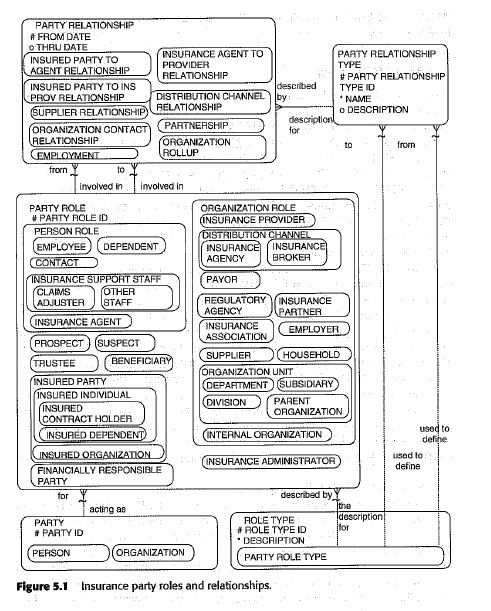

# People and Organization in Insurance

## Conceptual models include the following

    - Party
    - PartyRole(s)
    - PartyRelationship(s)

## Person Roles

    - DEPENDENT: Is one where a person is related to the primary INSURED PARTY.
                 The DEPENDENT party role signifies a party that is a dependent of another party even if the they 
                 are not a dependent on an insurance policy.
                 For example, for a health insurance policy, "Jane Doe" is in the role of the INSURED PARTY, 
                 as she gets her health insurance through her employer. She has added to her policy her family members "John Doe" 
                 and "JR Doe" as additional insured dependents, and therefore they need to be dependents of Jane Doe in order to qualify.
    
    - CLAIM_ADJUSTER: One individual assesses damage from a particular incident. The major focus of this role is to determine 
                      the current state of the item and to assist in valuing the item and determining the cost of restoration.
                      The main function of the role is to supply the insured with the restoration of the loss at a fair and reasonable price.

    - INSURANCE_AGENT: Wwhose role is to sell and service INSURANCE PRODUCTS for the INSURED PARTYS.

## Organization Roles

    - INSURANCE_PROVIDER: An ORGANIZATION that underwrites the INSURANCE PRODUCTS.

    - DISTRIBUTION_CHANNEL: An ORGANIZATION designed to sell the insurance providers' INSURANCE PRODUCTS to an insured party.
                            It could be an outside, independent group with access to PROSPECTIVE customers of INSURANCE PRODUCTS.
                            For instance, certain banks may be distribution channels for providing mortgage insurance on loans.
                            Travel agencies may be distribution channels for providing travel insurance to their clients.
                            DISTRIBUTION CHANNELS may be subtyped into INSURANCE AGENCY and INSURANCE BROKER.
   
    - INSURANCE_AGENCY: A role that supports the sales, service, and distribution of many types of insurance PRODUCTS. 
                        These groups tend to employ many individuals who assist in varying aspects of the insurance processes:
                        preparing quotes, delivering of policies to the insured, handling claims, collect- ing funds, 
                        and handling fulfillment needs for the insured.
    
    - INSURANCE_BROKER: A role designed to represents any organization that has an arrangement with the insurance provider 
                        to sell their products.
                        The difference between an insurance agency and an insurance broker is typically that the insurance agency 
                        represents only one insurance provider while a broker represents multiple INSURANCE PROVIDERs.
                        Another difference is that a broker is not always in the direct business of selling insurance and 
                        often will sell insurance as a complement to their products.
                        For example, a travel agency may have a brokerage agreement to sell travel insurance and a bank may 
                        sell mortgage insurance as a complement to their loan-based services.
    
    - PAYOR: A role that is responsible for paying claims.

    - INSURANCE_PARTNER: An ORGANIZATION involved in joint ventures, mutually beneficial marketing arrangements, or 
                         where companies combine equity to support higher levels of risk.
                         These ORGANIZATIONS work with other groups in order to spread the risk of certain 
                         types of asset loss in order to keep costs and prices reasonable.
                         
    
    - INSURANCE_ASSOCIATION: An ORGANIZATION that standardizes various aspects of insurance operation.
                             These include risk analysis, language, practices, policy contracts and other critical items 
                             required by the insurance industry.

## Person or Organization Roles

    - PROSPECT: A role designed for who is interested in services offered by the insurance service enterprise.
                These parties may either seek out the insurance enterprise or may be contacted by them.

    - SUSPECT: A role designed for who are chosen for a marketing campaign but have not shown any interest in the solicitations made to them.
               Often within the insurance industry, marketing will purchase lists of names to offer services to and will 
               send information to those parties.

    - TRUSTEE: A role whose duty is to protect specific funds from a policy. 
               The insurance provider may be a TRUSTEE in that it administers the funds of the policy and serves as a trustee for the insured.
               The party may be paid a monetary fee in filling this role as it is compensated for its administrative work.

    - BENEFICIARY: A BENEFICIARY is the recipient of the claims settlement amounts from the policy in the event that 
                   the INSURED PARTY loses either life or health.

    - INSURED_PARTY: The PARTY filling this role when the policy is established.
                     An INSURED PARTY is the person or organization that is covered for insurance.

    - INSURANCE ADMINISTRATOR: a role that is often filled by an outside PARTY to handle the administrative functions 
                              concerning the servicing of the INSURANCE PRODUCT. This would be the ORGANIZATION or PERSON 
                              who takes the information and handles changes, claims, and other work efforts 
                              in order to provide the insured party with the support required.

## Insurance Party Relationships

    - INSURED PARTY TO INS PROV RELATIONSHIP: The primary relationship between the INSURANCE PROVIDER and an INSURED PARTY.
                                              This relationship is where an INSURED PARTY will receive insurance coverage 
                                              from the INSURANCE PROVIDER in the event of loss.

### Examples

| Party                    | Party-Role              |
|--------------------------|-------------------------|
| Saman Insurance Co       | INSURANCE_PROVIDER      |
| Zitro Co                 | DISTRIBUTION_CHANNEL    |
| Digikala Co              | DISTRIBUTION_CHANNEL    |
| Digikala Co              | INSURANCE_BROKER        |
| AmirMehdi Ebrahimian Co  | INSURANCE_AGENCY        |
| Digikala Warranty        | PAYOR                   |
| Aria Safarzadeh          | ?                       |
| Alireza zeynali          | INSURED_PARTY           |
| Alireza zeynali          | ?                       |
|                          |                         |
| AmirMehdi Ebrahimian     | Insurance Administrator |
| Fatemeh Yeganeh          | CLAIM_ADJUSTER          |
|                          |                         |
| Online users of EE       | PROSPECT                |
| Digikala unbundled users | SUSPECT                 |
| ?                        | Trustee                 |
| ?                        | BENEFICIARY             |
|                          |                         |
| ?                        | INSURANCE_PARTNER       |
| ?                        | INSURANCE_ASSOCIATION   |
|                          |                         |                   

| From-Party               | To-Party             | Party-Relationship-Type                |
|--------------------------|----------------------|----------------------------------------|
| Digipay Insurance Co     | Saman Insurance Cc   | INSURANCE_AGENCY_RELATIONSHIP          |
|                          |                      |                                        |
| Digikala Co              | Digipay Insurance Co | DISTRIBUTION_CHANNEL_RELATIONSHIP      |
| Zitro Co                 | Digipay Insurance Co | DISTRIBUTION_CHANNEL_RELATIONSHIP      |
| Digikala Warranty        | Digipay Insurance Co | PAYOR_RELATIONSHIP                     |
|                          |                      |                                        |
| Online users of EE       | Digipay Insurance Co | PROSPECT_RELATIONSHIP                  |
| Digikala unbundled users | Digipay Insurance Co | SUSPECT_RELATIONSHIP                   |
|                          |                      |                                        |
| Alireza zeynali          | Saman Insurance Cc   | INSURED_PARTY_TO_INS_PROV_RELATIONSHIP |
| Alireza zeynali          | Digipay Insurance Co | EMPLOYEE_RELATIONSHIP                  |
|                          |                      |                                        |

## Conceptual Model Diagram

