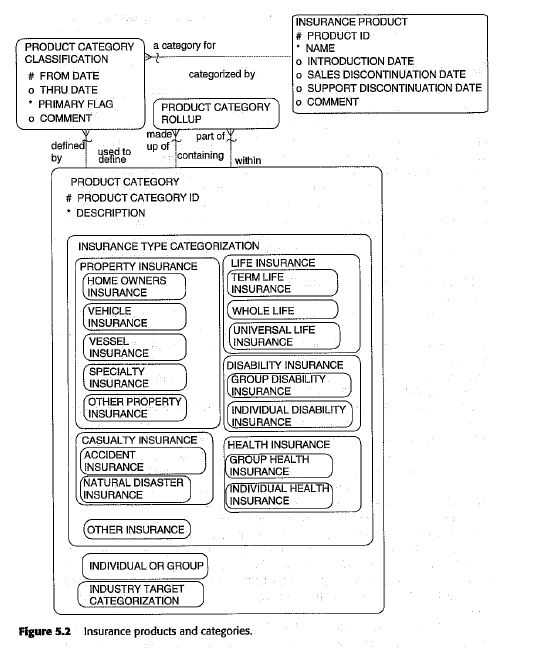
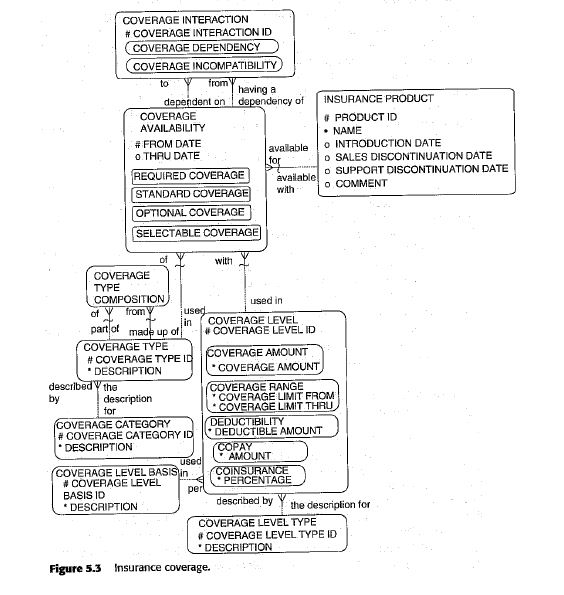
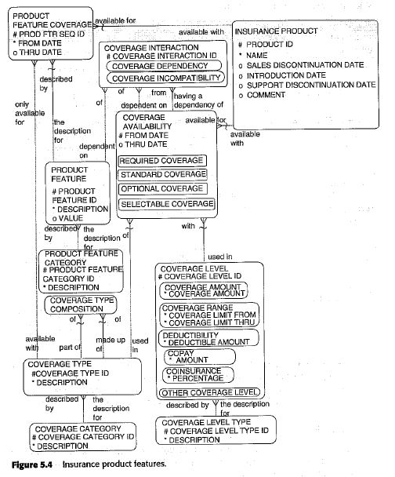
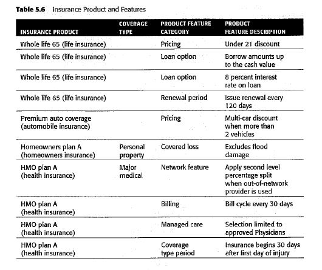
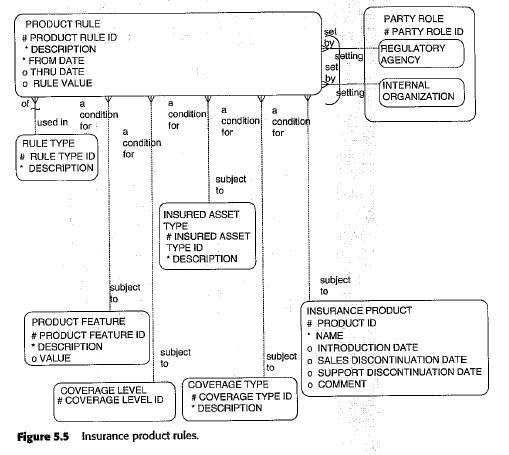
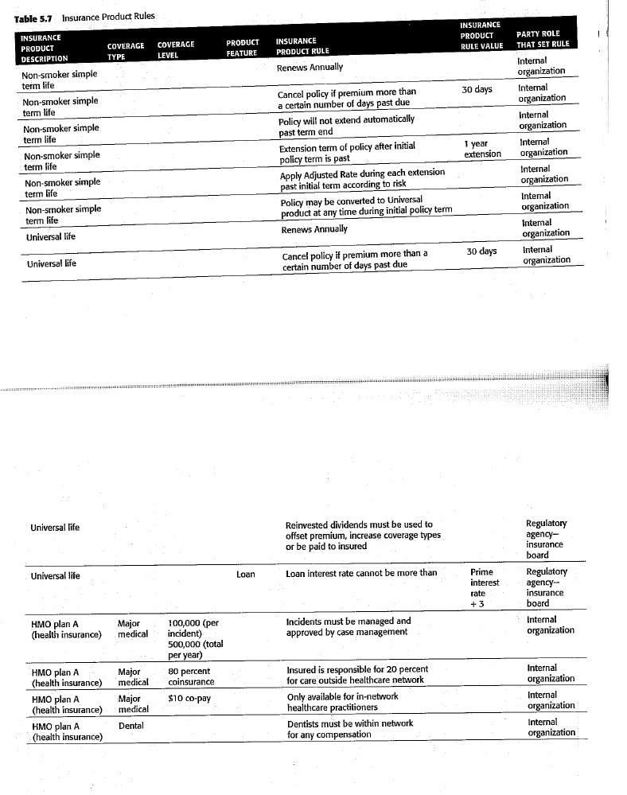
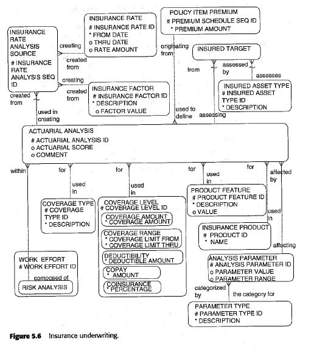
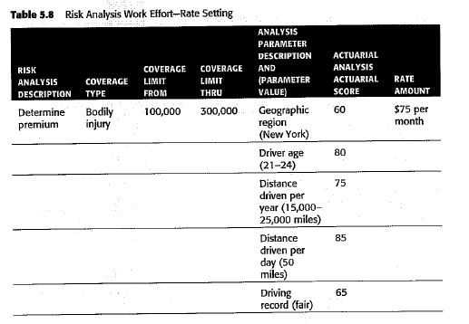

# Insurance Product

The main difference between an insurance product and other industries is that the product is not a manufactured,
tangible good but a service offered to protect against a loss. The insurance product is defined in terms of what
combinations of coverage types, coverage levels, and features are available under different insurance plans (products).
The product that is sold to the insured party will be based on these available combinations and then will be further
defined in an insurance policy agreement in which the insured will select from these available variations of the
product.
The agreement data models that will cover policies and the selection from the product's available coverage types,
coverage, and features will be discussed later in this chapter.

The products address the risk by focusing on what must be protected and by providing insurance coverage types with
certain coverage levels and features that offer compensation if loss occurs.

The model that will be presented takes into consideration the need for very flexible insurance product models that can
be easily customized or changed over time.

Insurance products are understood by:

- what is insured
- what types of insurance coverage apply
- how much is covered and
- what other options or features can be applied as well as the rules that dictate how the product will operate.

Regarding what is insured, each type of insurance protects different types of things. Property insurance protects
tangible assets such as a home, vehicle, vessel, special valuables, and other items against damage or loss.
Health insurance protects the loss of income against the illness of the insured and covers the cost of treatment
of that illness. Other insurance coverage exists for many other potential loss situations.

## Insurance Product and Categories

With the above explanations, what constitutes an instance of an insurance product and what constitutes
an insurance product category? This is dependent on the insurance enterprise and how it structures its products.

A product may be as simple as "health care insurance" or more likely, the enterprise has designed specific
insurance plans that all fall into the health care insurance category such as "PPO Plan A" or "HMO Plan A." These
products are usually designed to be very flexible and each product may specify different combinations of coverage types,
coverage levels, and features that are possible within the product.

## Insurance Product Coverage

Each type of insurance product needs to specify **the available coverage types**, **what level of coverages** are
available, and what **types of features** can be applied.

### Details behind Coverage Type Coverage Levels

The COVERAGE TYPE and COVERAGE LEVEL entities are key components to the insurance product.
By reviewing these in detail, it will be shown how they can support multiple flexible views of similar products.

The COVERAGE TYPE defines what types of coverages can exist in the product. Does the product support major medical,
hospitalization, and dental? Does the product offer bodily injury coverage, comprehensive, or collision? **These are
examples of types of coverage**.

The COVERAGE LEVEL describes possible amounts of risk protections that can be available to be used to further describe
the insurance being offered in an insurance product.

COVERAGE LEVEL subtypes include:

- COVERAGE AMOUNT,
- COVERAGE RANGE,
- DEDUCTIBILITY,
- COINSURANCE,
- COPAY and
- as well as numerous other possibilities that could be defined.

**COVERAGE AMOUNT:** It defines a single amount of insurance coverage that may be available for products such as a
standard amount of $100,000 for a life insurance policy.

**COVERAGE RANGE:** It describes numerous values for insurance coverage such as "100,000" and "300,000" for bodily
injury on a car insurance policy.

**DEDUCTIBILITY:** It is another way of describing the level of coverage because it describes how much the insured
party has to pay before the payor will pay insurance claims.

**COINSURANCE:** It states what percentage of the amount the payor pays as opposed to the amount that the insured
party pays.

**COPAY:** It defines how much the insured party pays for a healthcare practitioner's visit for in-network services.

The COVERAGE AVAILABILITY describes what is or can be included in the product in terms of the combinations of
COVERAGE TYPES and COVERAGE LEVELS just described.

The COVERAGE AVAILABILITY is subtyped into the:

- REQUIRED COVERAGES: which are a mandatory part of the insurance offering.
- STANDARD COVERAGE: which includes default features of the product that can be customized.
- OPTIONAL COVERAGE: which allows the insured party the ability to select or not select these features.
- SELECTABLE COVERAGES: which require a selection from among several available options.

## Insurance Product Feature

Examples:

## Insurance Product Rule

Examples:

## Insurance Pricing

Examples:

# Mapping and configuration of Electronic Equipment Insurance Product

## Product Category

| Product-Category   | Product-Category            | Product-Category                 | Product-Category                 |
|--------------------|-----------------------------|----------------------------------|----------------------------------|
| Property Insurance | Digital Equipment Insurance | Used Digital Equipment Insurance |                                  |
|                    |                             |                                  |                                  |
| Property Insurance | Digital Equipment Insurance | Mobile device Insurance          | Used Digital Equipment Insurance |
|                    |                             |                                  |                                  |

## Product

| Product-Category   | Product-Category            | Product-Category                 | Product-Category                 | Product                                |
|--------------------|-----------------------------|----------------------------------|----------------------------------|----------------------------------------|
| Property Insurance | Digital Equipment Insurance | Used Digital Equipment Insurance |                                  | Mobile Insurance                       |
|                    |                             |                                  |                                  | Tablet Insurance                       |
|                    |                             |                                  |                                  | Laptop Insurance                       |
|                    |                             |                                  |                                  | Game-console Insurance                 |
|                    |                             |                                  |                                  |                                        |
| Property Insurance | Digital Equipment Insurance | Mobile device Insurance          |                                  | Subscription Based Equipment Insurance |
|                    |                             |                                  |                                  |                                        |
| Property Insurance | Digital Equipment Insurance | Mobile device Insurance          | Used Digital Equipment Insurance | Saman Plan A                           |
| Property Insurance | Digital Equipment Insurance | Mobile device Insurance          | Used Digital Equipment Insurance | Parsian Plan A                         |
|                    |                             |                                  |                                  |                                        |

## Product Coverage Type

| Coverage             | Coverage-Description                                                                                                                                                |
|----------------------|---------------------------------------------------------------------------------------------------------------------------------------------------------------------|
| Mechanical Breakdown | You’ll be covered if your phone’s out of warranty and breaks down or stops working properly                                                                         |
| Accidental Damage    | If you accidentally damage your phone, including cracking your screen, your insurer will pay for repairs or to replace it                                           |
| Damage Due to Fire   | If you lost your phone in fire                                                                                                                                      |
| Liquid Damage        | If your phone’s been damaged through splashes, spills, or full immersion, your phone cover will pay to get it fixed or replaced                                     |
| Theft                | If your phone’s stolen, your cover will replace it with the same make and model, or a phone with the equivalent specification                                       |
| Accidental Damage    | If you accidentally damage your phone, including cracking your screen, your insurer will pay for repairs or to replace it                                           |
| Natural Disaster     | If you lost your phone due to  flooding, earthquake                                                                                                                 |
| Lost                 | If you lose your phone, your cover will replace it with a similar model. With some policies, this is an optional extra you’ll need to pay an additional premium for |
| E-Wallet             | If your phone is accidentally lost or stolen, you’ll be refunded the cost of unauthorised transactions made using your e-wallet, up to a limit                      |
|                      |                                                                                                                                                                     |

## Coverage Availability

| Product-Category                 | Product          | Product-Coverage-Type | Coverage-Level-Basis        | Coverage-Availability-Type |
|----------------------------------|------------------|-----------------------|-----------------------------|----------------------------|
| Used Digital Equipment Insurance | Mobile Insurance | Accidental Damage     | Once Occurrence, 0 Percent  | Required                   |
|                                  |                  | Theft                 | Once Occurrence, 20 Percent | Required                   |
|                                  |                  | Damage Due to Fire    | Once Occurrence, 0 Percent  | Selectable                 |
|                                  |                  | Lost                  | Once Occurrence, 0 Percent  | Selectable                 |
|                                  |                  | Natural Disaster      | Once Occurrence, 0 Percent  | Selectable                 |
|                                  |                  | Mechanical Breakdown  | Once Occurrence, 0 Percent  | Optional                   |
|                                  |                  |                       |                             |                            |

## Product Feature Category and Product Feature

### Product Feature Category

| Product-Feature-Category |
|--------------------------|
| Covered Loss             |
| Pricing                  |
| Loan Options             |
| Renewal Period           |
| Billing                  |
| Coverage Type Period     |
|                          |

### Product Feature

| Product-Feature-Category | Product-Feature                                            |
|--------------------------|------------------------------------------------------------|
| Covered Loss             | Exclude Flood Damage                                       |
|                          | Exclude Extra Accessories Damage                           |
|                          |                                                            |
| Coverage Type Period     | Insurance begins after 30 days after first day of incident |
|                          |                                                            |
| Loan Options             | 8 percent loan                                             |
|                          | 10 percent loan                                            |
|                          |                                                            |
| Pricing                  | Under 21 discount                                          |
|                          | Multi-device discount when more than two mobiles           |
|                          |                                                            |

### Product Feature Coverages

| Product-Category                 | Product          | Product-Coverage-Type | Product-Feature                                                   |
|----------------------------------|------------------|-----------------------|-------------------------------------------------------------------|
| Used Digital Equipment Insurance | Mobile Insurance | Accidental Damage     | Exclude Flood Damage                                              |
|                                  |                  |                       | Exclude Extra Accessories Damage                                  |
|                                  |                  | Coverage Type Period  | Insurance begins after 30 days after first occurrence of incident |
|                                  |                  |                       |                                                                   |
|                                  | Game-console     |                       | 8 percent loan                                                    |
|                                  |                  |                       | 10 percent loan                                                   |
|                                  |                  |                       |                                                                   |

### Insurance Pricing
